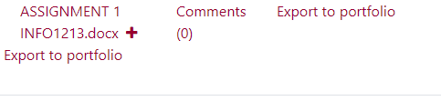
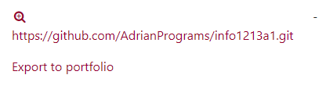
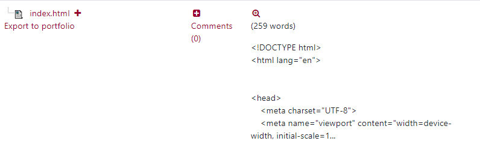
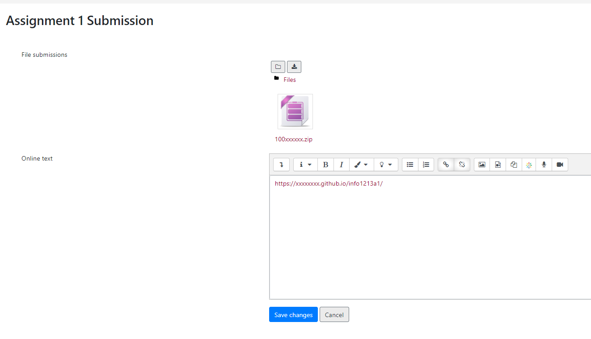
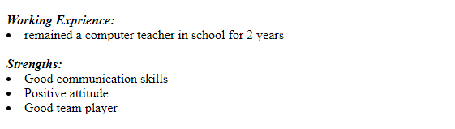
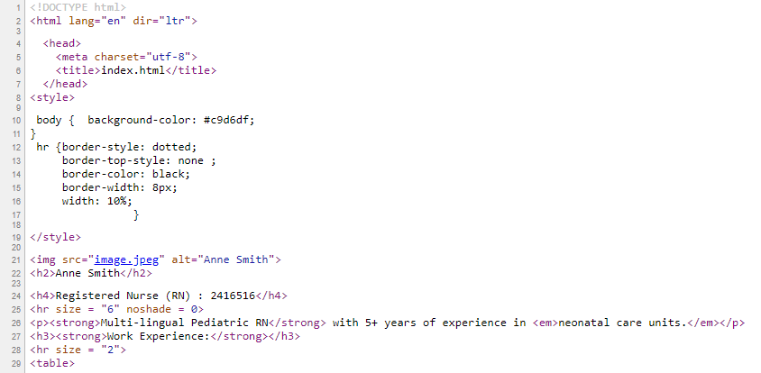
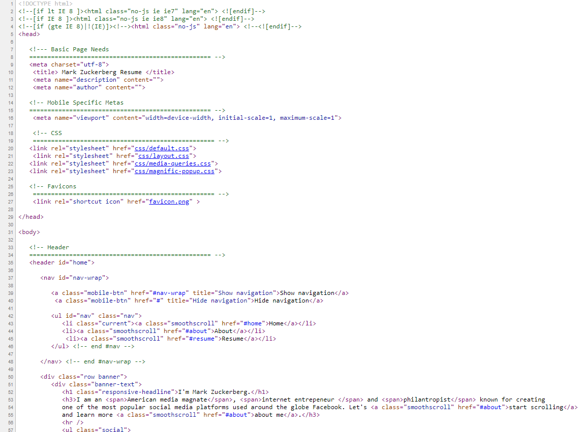
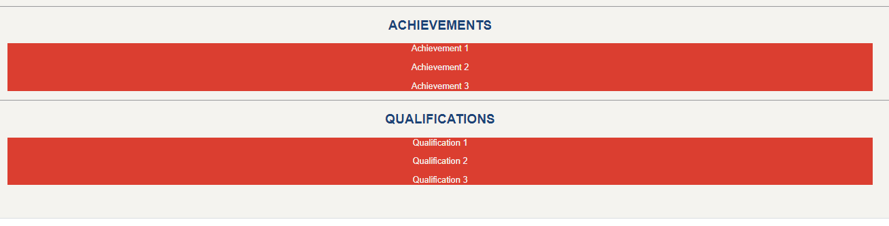
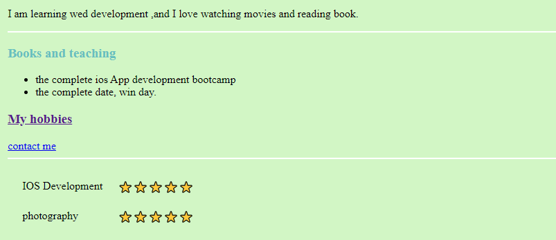

# Assignment 1 Feedback

## Regarding Submission

Assignment 1 Instruction has a section that clearly stated that required submission format, which requires both a working Github Page link, and the zip (not .rar) file that contains the website files. Submissions that do not follow the requirement may get a 0. 

### Incorrect Submission Examples:

#### Incorrect Submission Example 1 

#### Incorrect Submission Example 2

#### Incorrect Submission Example 3

### Correct Submission 

## Regarding CSS
Assignment 1 requires the use of CSS. Please make sure that you have connected the external CSS file to the HTML files. 

#### No-CSS examples

#### Not-External-CSS examples

### Suspected Plagiarism

#### Suspected Plagiarism Example 1 

#### Suspected Plagiarism Exaple 2

### Submissions that may need extra effort
#### Example 1

#### Example 2

